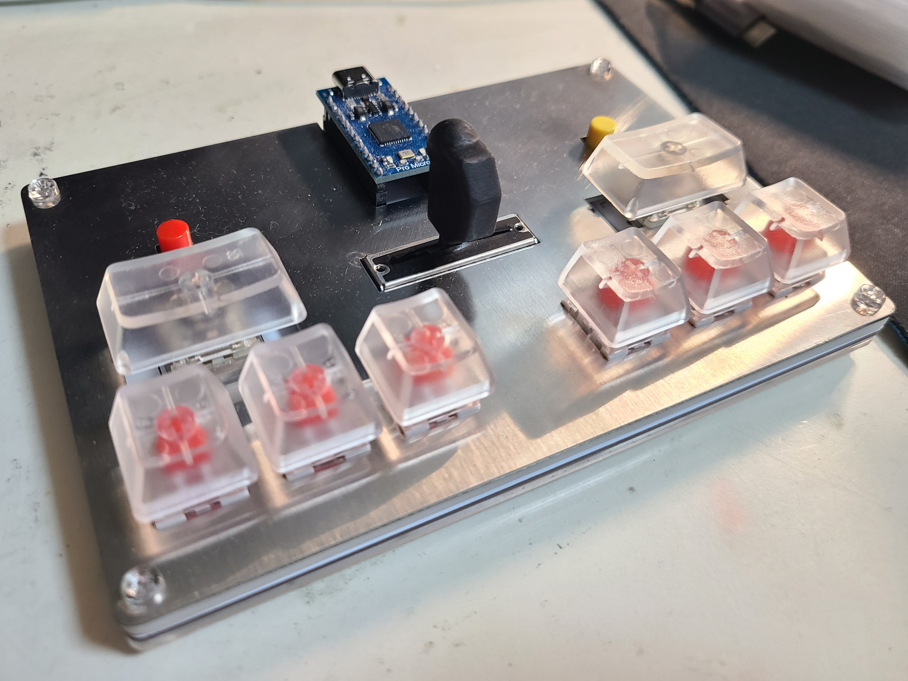

# Minigeki v0.3

This is a mini controller for SEGA's arcade rhythm game ONGEKI.

Also posted on BEMANICN forum (in Chinese): [[图一乐\]音击迷你控制器的制作 - BEMANICN](https://bemani.cc/d/142)

## Structure

This controller is composed of 5 layers stacking together and fixed by four M3*12mm screws. The five layers are:

top - 		 			1.5mm

above pcb - 		3.5mm

PCB -					1.6mm

under pcb - 		>=2mm

bottom - 	 		>=1mm

You can use 3D printing, sheet metal, acrylic boards, or any material strong enough to build the layers except for PCB. For the PCB, you can order it at your local PCB manufacturer. Notice that the minimum hole size is 12mil.

For the microcontroller, you will need a SparkFun Pro Micro (ATMega32U4) or its "improved" (counterfeit) version. I used a type-c version.

You will need 8 MX key switches for the 6 buttons and side buttons, each with a 6028 WS2812B and a hot swap socket from kalih. I recommend to use 1.75U (1.75 times width) keycaps for the side buttons. As for the menu buttons, I used 6*6mm SMD buttons and corresponding red and yellow keycaps.

A 35mm linear potentiometer is a good replacement of the lever on the original arcade. It becomes even better when you have a 3D printed mini knob on it

To assemble the all the components into a working controller, you will need a soldering iron and a screw driver.

## Software

You can use [XxLittleCxX/ongeki-io: Yet another ongeki io (github.com)](https://github.com/XxLittleCxX/ongeki-io) with my slightly modified version of mu3controller firmware; Or, use the keyboard (and mouse for lever) firmware I wrote. Either of which requires PlatformIO to compile and upload.

## License

You can copy, distribute, modify, or build on this project freely, even for commercial purposes, under the condition that you must attribute the work (include me in authors.txt or mention my name in documents).

